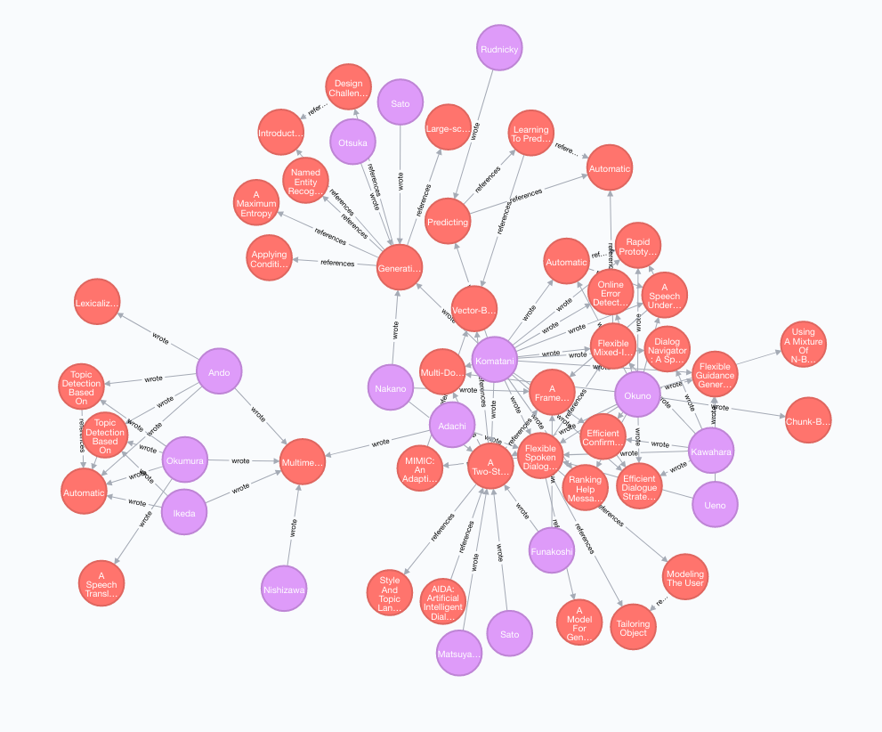

<!-- $theme: invert -->

# Citation Patterns in Research Papers

## Simon Bordewisch
## Tim Niehoff
## Dennis Kreußel

---
<!-- page_number: true -->
# Datensätze

---

## ANN
	x Knoten, Y Kanten
## DBLP
	()
## CiteSeer$^{X}$
	()
---

# ANN 

---

# Zielstellung

* Abbildung Debatte etc.
*

---

# Relevante Konzepte

---

# Erster Prototyp

* Mockups

---

# Demo

---

# Ausblick

---

# 

---