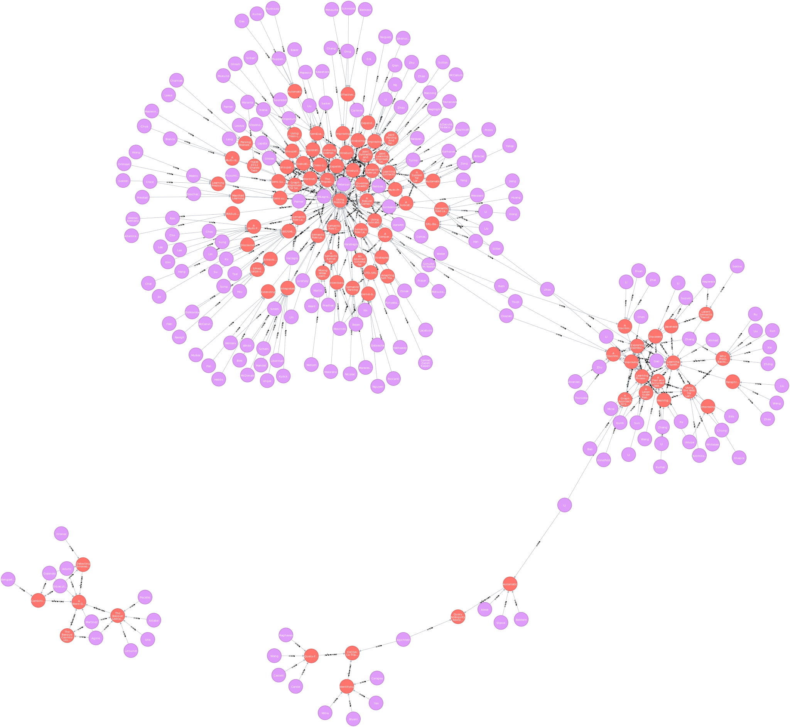
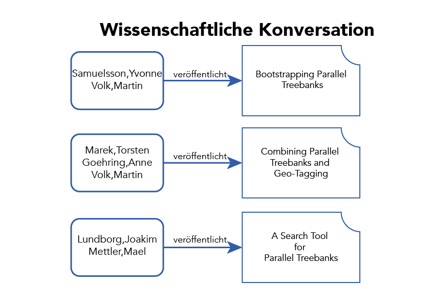

<!-- $theme: invert -->

# Citation Patterns in Research Papers

## Simon Bordewisch
## Tim Niehoff
## Dennis Kreußel

---

# Einführung

---
<!-- page_number: true -->
# Datensätze

1. ANN
2. DBLP
3. CiteSeer$^{X}$
4. arXiv

---

# Ziele

## TODO: 
* Schritt 1 zur umsetzung der vision ist das reproduzieren von references kapiteln
* Schritt 2 ...
* welche info bedürfnisse sollen gestillt werden
* wie sollen die infos dargestellt werden
* an wen richtet sich die anwendung

---

## ANN
	22460 Paper 
    18862 Autoren
    170146 Relationen
## DBLP
	:!TODO!:
## CiteSeer$^{X}$
	:!TODO!:
---

# ANN 

* Texte aus PDF extrahiert

---

# Relevante Konzepte

* Relevanz von Paper zu Paper
* Semantische Analyse von Zitationen
* Clustering
* Topic Modelling
* 

---

# Technologien

* PDFBox → PDF zu Text
* ParsCit → Parsen der individuellen Referenzen
* Rails → backend api und webserver 
* Neo4j → Zitationsgraph
* reactjs → Frontend rendering
* d3js → data rendering
* vx → svg rendering

---
# Probleme
* Mangel nach brauchbaren Datensätzen
* Sentiment Analyse weitgehend unerforscht
* 

---

# Demo
---

# Architektur

* 3 (Backend + DB) jeweils in Docker container
* frontend reactjs 

---

# Ausblick

* Welche Probleme sind als nächstes zu lösen?
* groben Zeitrahmen
* citeseer$^{X}$

---